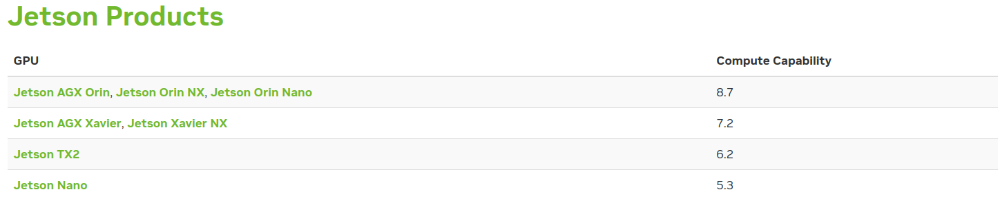

# Deepstream face recognition on jetson

Current only support jetpack version 4.6.1

## Get cuda compute



Eg: DGPU_ARCHS=72 for jetson AGX Xavier

## Install custom tensorRT

```bash
export TRT_OSS_CHECKOUT_TAG=release/8.2 \
&& export TENSORRT_REPO=https://github.com/hiennguyen9874/TensorRT \
&& export DGPU_ARCHS=<JetsonCudaComputeCapability> \
&& cd /tmp \
&& git clone -b $TRT_OSS_CHECKOUT_TAG $TENSORRT_REPO \
&& cd /tmp/TensorRT \
&& git submodule update --init --recursive \
&& mkdir -p build \
&& cd /tmp/TensorRT/build \
&& cmake .. -DGPU_ARCHS=$DGPU_ARCHS \
-DTENSORRT_ROOT=/usr/src/tensorrt \
-DCMAKE_CUDA_COMPILER=/usr/local/cuda-10.2/bin/nvcc \
-DCUDA_INCLUDE_DIRS=/usr/local/cuda/include \
-DTRT_LIB_DIR=/usr/lib/aarch64-linux-gnu/ \
-DCMAKE_C_COMPILER=/usr/bin/gcc \
-DTRT_BIN_DIR=`pwd`/out \
&& make nvinfer_plugin -j$(nproc) \
&& cp $(find /tmp/TensorRT/build -name "libnvinfer_plugin.so.8.*" -print -quit) \
$(find /usr/lib/aarch64-linux-gnu/ -name "libnvinfer_plugin.so.8.*" -print -quit) \
&& ldconfig \
&& cd /tmp \
&& rm -rf /tmp/TensorRT
```

## Set default runtime to nvidia

https://github.com/dusty-nv/jetson-containers#docker-default-runtime

## Install nvidia-tensorrt

-   `sudo apt install nvidia-tensorrt`

## Docker

-   Build or pull: `docker build -t hiennguyen9874/deepstream-face-recognition:jetson-deepstream-6.0.1 -f Dockerfile.jetson .` or `docker pull hiennguyen9874/deepstream-face-recognition:jetson-deepstream-6.0.1`
<!-- -   `docker push hiennguyen9874/deepstream-face-recognition:jetson-deepstream-6.0.1` -->
-   Run: `docker run --runtime nvidia --device /dev/video1 --rm -it -v $(pwd):/app hiennguyen9874/deepstream-face-recognition:jetson-deepstream-6.0.1 bash`

# Install Opencv

Inside docker or outside docker
https://forums.developer.nvidia.com/t/jetson-docker-image-opencv/164792
